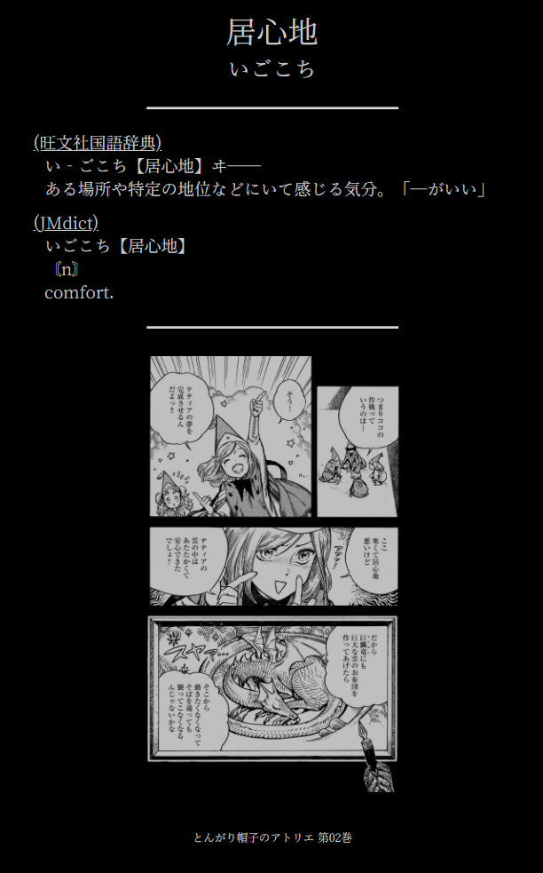

# Memo2Anki
Mine from pdfs created with [Mokuro2Pdf](https://github.com/Kartoffel0/Mokuro2Pdf)
<p align="center">
  
</p>

### To use Memo2Anki please make your sure your Kindle's language is set to either Brazilian Portuguese, English or Japanese

# Features
- Semi-automatic ```Word, Reading, Definition, Manga Page, Audio, BookName``` Anki cards creation with definitions from how many Yomichan dictionaries you want and audio from JapanesePod
- Manual selection of which book the script will mine the words from, the amount of cards to be created and the minimum frequency rank a word needs to have in order to be added
- No need to import any APKG files as the cards are created using AnkiCOnnect

# Installation
- Install SudachiPy
`pip install sudachipy sudachidict_full`
- Install Pypdfium2
`pip install --no-build-isolation -U pypdfium2`
- Install [AnkiConnect](https://ankiweb.net/shared/info/2055492159) if you don't have it already installed
- Clone this repository

# Usage
### [Convert Mokuro's html overlay to PDF](https://github.com/Kartoffel0/Mokuro2Pdf)
- DO NOT remove "MKR2PDF" from the generated pdf's filename, without that this script will not work
- Copy the generated pdf file to Memo2Anki's root directory

### While reading:
- Select the word you want to mine
- Press "Nota|Note|メモ" to add create a note
- Type in the word you want to mine
- Hit save

### Running the script:
#### This script utilizes AnkiConnect, make sure you have Anki running on the background before you run the script
- Copy `My Clippings.txt` from your Kindle's storage by going to ```documents/```, or by searching for "My Clippings.txt", to Memo2Anki's folder
- Run the script
- Choose the book you want to mine from when prompted to
- Choose how many cards you want the script to generate when prompted to
- Wait for it to finish running and enter "OK" to close the script when prompted to

### First run setup
- You'll have to install your dictionaries and frequency lists, make sure you have all of them in the same folder as the Memo2Anki.py file
- The script is not compatible with Pitch Accent dictionaries
- The script is also not compatible with multiple-frequency frequency lists, please use one with only 1 frequency per word
- Be careful when entering your deck and card info, any mistypes will result in the script not working properly

## Note that:
- This script will only create cards for japanese words
- This script will not generate any duplicate cards
- The cards are generated automatically, flaws are expected
- This script will only try to create a card for a specific word once, if you delete a faulty card it will not be created again on the next run.
